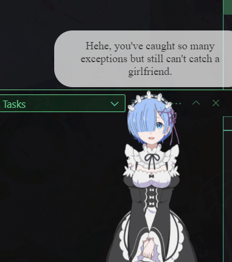

# vscode-rfwaifu-rem-config
A blue hair virtual waifu Rem will accompany with you while coding (VSCode rainbow fart extension with Rem, English subtitles)

# Preview
This setup will "install" an anime waifu(Technically, _wife_) "Rem" on your **Visual Studio Code**

Visit **https://github.com/ezshine/vscode-rainbow-fart-waifu** and conduct installation procedure on your VSC, then download this configuration file in your own `vscode-rainbow-fart-waifu` configuration folder.

Also, don't forget to install **live2d** program to show up this cute Rem always!



## File structures & Notes
This configuration **complies** `vscode-rainbow-fart-waifu`'s internal configuration folder structure, so you just need to copy and paste the whole folder in the folder. If that "waifu" extension keep set someone else's voice pack folder as default, then override that voice folder instead with Rem's.(a little trick). Rem is better, isn't she?

- The folder `live2dpackages` contains Rem's live2d data
- The folder `voicepackages` contains Rem's live2d voice and keyword-voice mapping configuration file, `contribute.json`. You can modify this file to adjust keyword-voice mappings or subtitles.
```
📦rem
 ┣ 📂live2dpackages
 ┃ ┗ 📂rem
 ┃ ┃ ┣ 📂motions
 ┃ ┃ ┃ ┣ 📜Live2D_remu01.mtn
 ┃ ┃ ┃ ┣ 📜Live2D_remu02.mtn
 ┃ ┃ ┃ ┣ 📜Live2D_remu03.mtn
 ┃ ┃ ┃ ┣ 📜Live2D_remu04.mtn
 ┃ ┃ ┃ ┣ 📜Live2D_remu05.mtn
 ┃ ┃ ┃ ┣ 📜Live2D_remu06.mtn
 ┃ ┃ ┃ ┣ 📜Live2D_remu07.mtn
 ┃ ┃ ┃ ┣ 📜Live2D_remu08.mtn
 ┃ ┃ ┃ ┣ 📜Live2D_remu09.mtn
 ┃ ┃ ┃ ┣ 📜Live2D_remu10.mtn
 ┃ ┃ ┃ ┣ 📜Live2D_remu11.mtn
 ┃ ┃ ┃ ┣ 📜Live2D_remu12.mtn
 ┃ ┃ ┃ ┣ 📜Live2D_remu13.mtn
 ┃ ┃ ┃ ┣ 📜Live2D_remu14.mtn
 ┃ ┃ ┃ ┣ 📜Live2D_remu15.mtn
 ┃ ┃ ┃ ┣ 📜Live2D_remu16.mtn
 ┃ ┃ ┃ ┣ 📜Live2D_remu17.mtn
 ┃ ┃ ┃ ┣ 📜Live2D_remu18.mtn
 ┃ ┃ ┃ ┣ 📜Live2D_remu19.mtn
 ┃ ┃ ┃ ┣ 📜Live2D_remu20.mtn
 ┃ ┃ ┃ ┣ 📜Live2D_remu21.mtn
 ┃ ┃ ┃ ┣ 📜Live2D_remu22.mtn
 ┃ ┃ ┃ ┣ 📜Live2D_remu23.mtn
 ┃ ┃ ┃ ┣ 📜Live2D_remu24.mtn
 ┃ ┃ ┃ ┣ 📜Live2D_remu25.mtn
 ┃ ┃ ┃ ┣ 📜Live2D_remu26.mtn
 ┃ ┃ ┃ ┣ 📜Live2D_remu27.mtn
 ┃ ┃ ┃ ┣ 📜Live2D_remu28.mtn
 ┃ ┃ ┃ ┣ 📜Live2D_remu29.mtn
 ┃ ┃ ┃ ┣ 📜Live2D_remu30.mtn
 ┃ ┃ ┃ ┣ 📜Live2D_remu31.mtn
 ┃ ┃ ┃ ┣ 📜Live2D_remu32.mtn
 ┃ ┃ ┃ ┣ 📜Live2D_remu33.mtn
 ┃ ┃ ┃ ┣ 📜Live2D_remu34.mtn
 ┃ ┃ ┃ ┗ 📜Live2D_remu_idle.mtn
 ┃ ┃ ┣ 📂remu2048
 ┃ ┃ ┃ ┣ 📜texture_00.png
 ┃ ┃ ┃ ┗ 📜texture_01.png
 ┃ ┃ ┣ 📜model.json
 ┃ ┃ ┣ 📜ReadMe.txt
 ┃ ┃ ┣ 📜remu.moc
 ┃ ┃ ┣ 📜remu.physics.json
 ┃ ┃ ┗ 📜remu.pose.json
 ┗ 📂voicepackages
 ┃ ┗ 📂rem
 ┃ ┃ ┣ 📜01.wav
 ┃ ┃ ┣ 📜02.wav
 ┃ ┃ ┣ 📜03.wav
 ┃ ┃ ┣ 📜04.wav
 ┃ ┃ ┣ 📜05.wav
 ┃ ┃ ┣ 📜06.wav
 ┃ ┃ ┣ 📜07.wav
 ┃ ┃ ┣ 📜08.wav
 ┃ ┃ ┣ 📜09.wav
 ┃ ┃ ┣ 📜10.wav
 ┃ ┃ ┣ 📜11.wav
 ┃ ┃ ┣ 📜12.wav
 ┃ ┃ ┣ 📜13.wav
 ┃ ┃ ┣ 📜14.wav
 ┃ ┃ ┣ 📜15.wav
 ┃ ┃ ┣ 📜16.wav
 ┃ ┃ ┣ 📜17.wav
 ┃ ┃ ┣ 📜18.wav
 ┃ ┃ ┣ 📜19.wav
 ┃ ┃ ┣ 📜20.wav
 ┃ ┃ ┣ 📜21.wav
 ┃ ┃ ┣ 📜22.wav
 ┃ ┃ ┣ 📜23.wav
 ┃ ┃ ┣ 📜24.wav
 ┃ ┃ ┣ 📜25.wav
 ┃ ┃ ┣ 📜26.wav
 ┃ ┃ ┗ 📜contributes.json
 ```

# Q&A
Do you know japanese?
> I don't know.